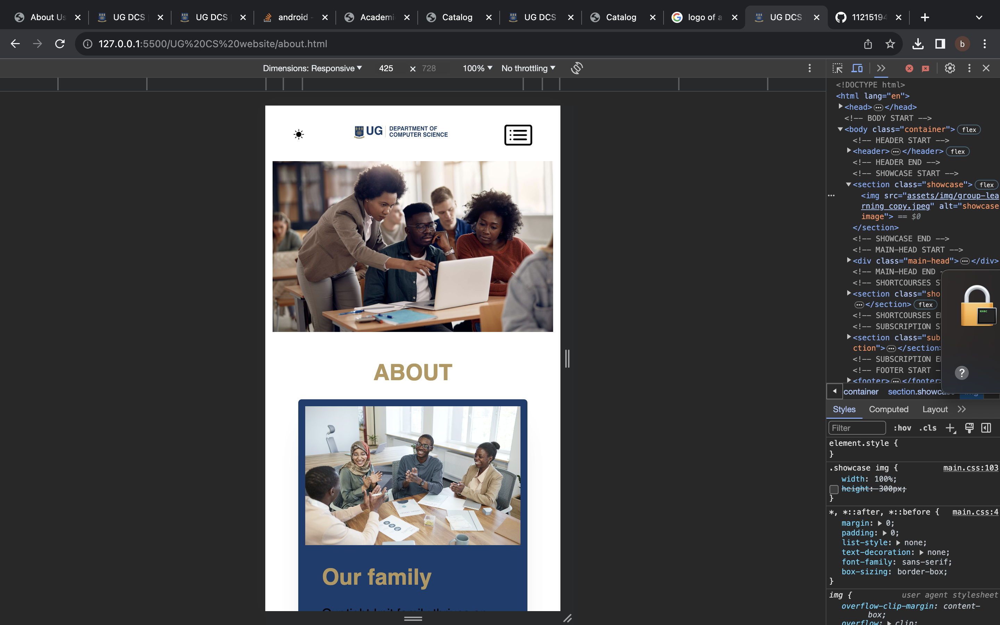
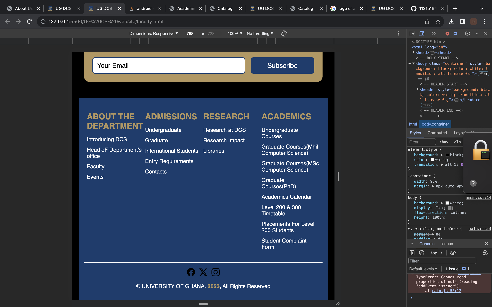
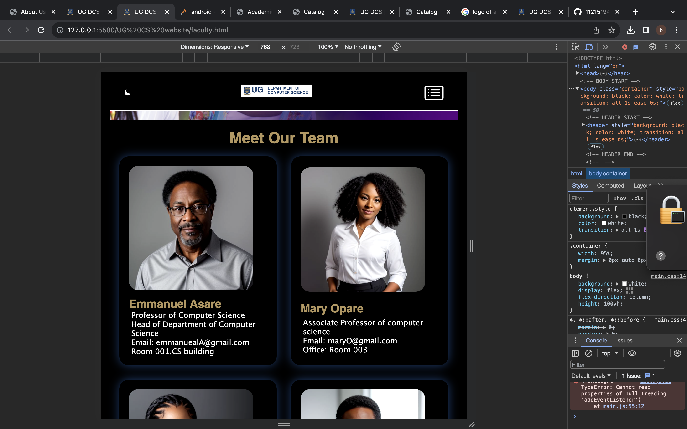
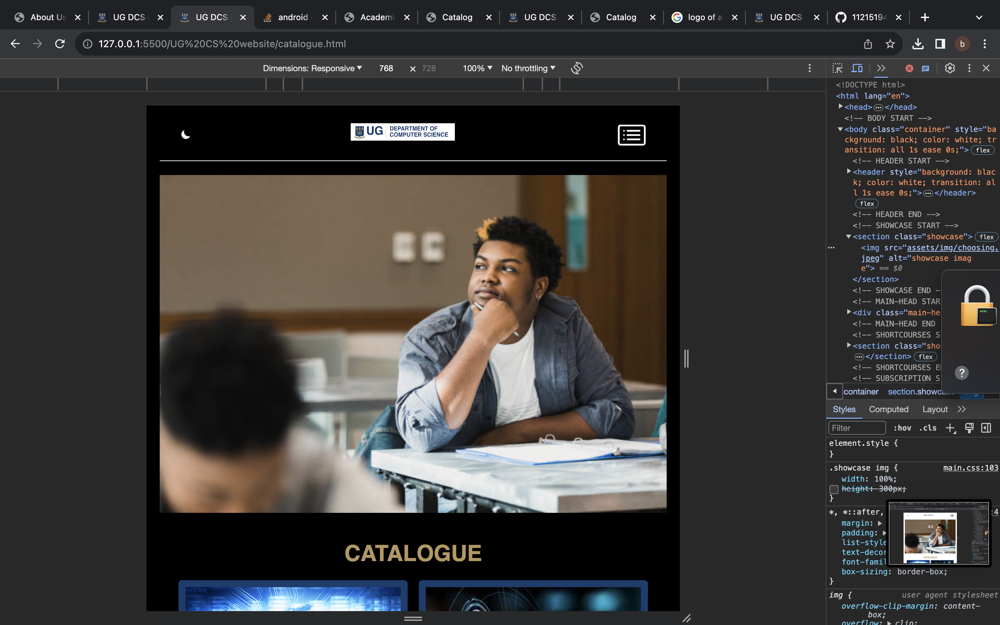
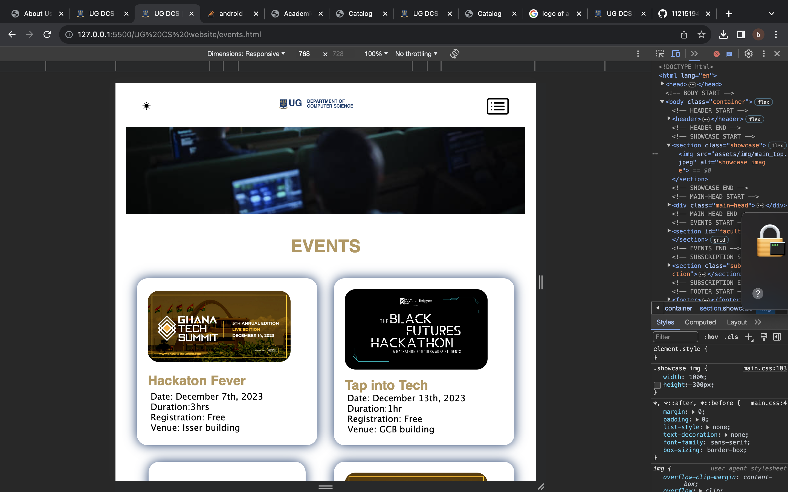
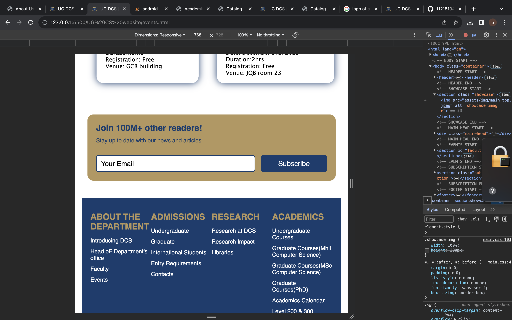
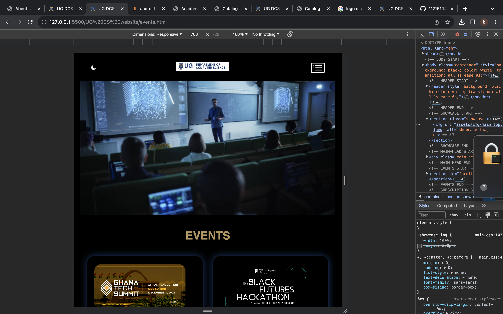
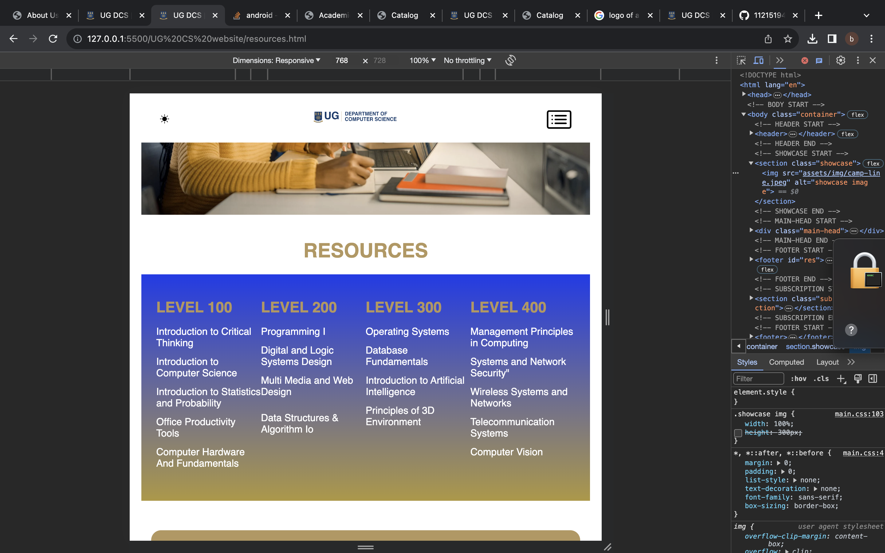

# DCIT_205_IA

* Author: [Brunella Naa Koshie Quaye]

* Student ID: [11215194] *

## Introduction to the README.md

Welcome to the CS Website project! This website is designed to serve as a comprehensive platform providing information about Computer Science programs, courses, and resources. It aims to offer a user-friendly interface for prospective students, educators, and tech enthusiasts to explore and gather insights into the field of Computer Science.

## Purpose of the Website

This website serves as an informative hub, designed to cater to prospective students, academia, and technology enthusiasts alike. My platform provides comprehensive insights into an array of Computer Science programs, delving into the specifics of Undergraduate Courses, Graduate Programs encompassing MPhil, PhD, and MSc, and offering intricate details about each program's curriculum, faculty members, and supplementary learning resources. Below is a list of the main objectives of the website.

* Here, I highlight the intricacies and unique facets of each program, providing detailed information about courses, specializations, and the academic structure tailored to each level of study.

* Additionally, visitors can explore detailed curriculum breakdowns, offering insights into the subjects covered, research opportunities.

* User-friendly interfaces employed in the creation of the website, clears pathways to information, and intuitive design elements ensure an enriching and hassle-free experience for all users.

### how to set up the project

Clone the Project
To clone this project, follow these steps:

* Open your terminal or command prompt.

* Use the git clone command and paste the repository URL:

bash
example code
' git clone https://github.com/your-username/cs-website.git '

#### Running the Project

Once the project is cloned:

* Open the HTML files in a web browser (e.g., Chrome, Firefox) by double-clicking or using a text editor like Visual Studio Code and right-clicking to "Open with Live Server."

## Screenshots

Here are the screenshots of each page of the website:

### Lessons Learned

Throughout this project, I have gained valuable experience in:

1. HTML and CSS development for web interfaces.
2. Organizing and structuring content effectively.
3. Creating a user-friendly interface for navigating through multiple pages.
4. Version control using Git and GitHub for collaborative development.
5. Problem solving skills. details are as follows

   In the process of developing this website, obtaining faculty members' pictures posed a unique challenge due to unavailability of their actual images on the internet. To supplement the absence of actual faculty photos, a combination of AI-generated pictures and sourced images from reputable websites related to academia were utilized.

   Lesson learnt: The process of acquiring suitable images prompted an exploration into innovative solutions to circumvent challenges faced in obtaining actual faculty photographs. This experience promoted a deeper understanding of utilizating technology-driven solutions and exploring diverse avenues to overcome constraints within web development.

   During the process, I encountered a situation where I needed to create a new folder to reorganize the contents from a previous folder whose location I couldn't ascertain. As a result, I moved the items to this newly created folder for better organization and accessibility.

